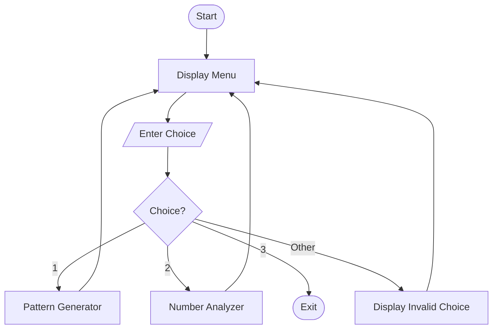
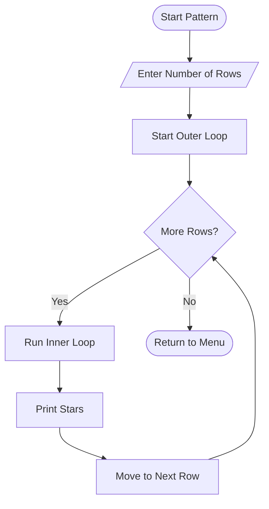
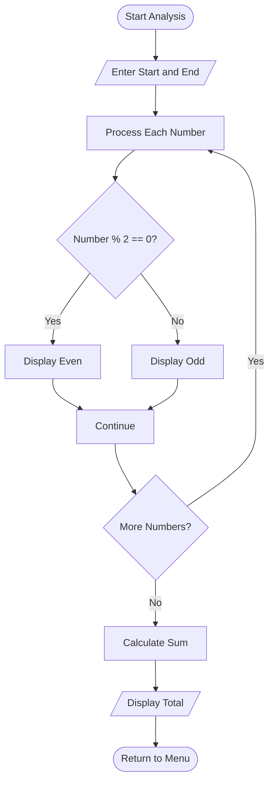
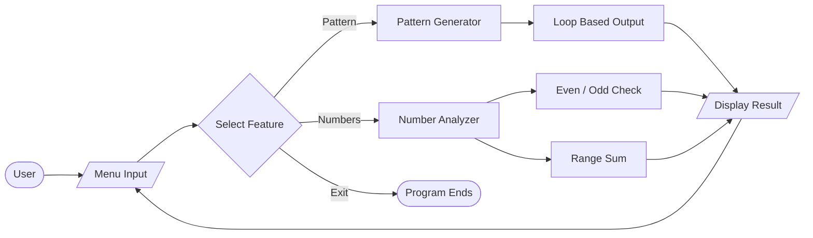
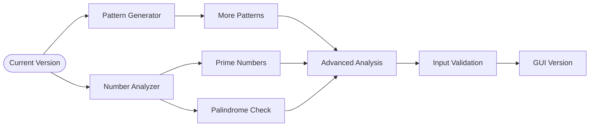

 🧠 Logic Box — Pattern Generator & Number Analyzer

> A beginner-friendly, menu-driven Python console application for practicing loops, conditions, user input, pattern generation, and basic number analysis.


## 📌 About the Project

**Logic Box** is an interactive Python application designed to strengthen fundamental programming logic.

The program provides three menu options:

| Option | Feature | Description |
|---:|---|---|
| `1` | ⭐ Pattern Generator | Generates a right-angled star pattern |
| `2` | 🔢 Number Analyzer | Checks numbers for even/odd status and calculates their sum |
| `3` | 🚪 Exit | Closes the application |

The menu runs continuously, allowing multiple operations without restarting the program.

---

## ✨ Features

### ⭐ 1. Pattern Generator

Enter the number of rows to generate a right-angled star pattern.

**Example:**

```text
Enter the number of rows for the pattern: 5

Pattern:
*
**
***
****
*****
```

**Logic:**

- The outer `for` loop controls the rows.
- The inner `for` loop prints the required number of stars.
- Each row contains one more star than the previous row.

---

### 🔢 2. Number Analyzer

Enter a starting and ending number to analyze the complete range.

The program:

- Checks every number in the range.
- Identifies each number as **even or odd**.
- Calculates the **sum of all numbers** in the range.

**Example:**

```text
Enter the start of the range: 1
Enter the end of the range: 5

Number 1 is odd
Number 2 is even
Number 3 is odd
Number 4 is even
Number 5 is odd

Sum of all numbers from 1 to 5 is: 15
```

---

### 🔄 3. Interactive Menu

The application continues running until option `3` is selected.

```text
Select an option:

1. Generate a Pattern
2. Analyze a Range of Numbers
3. Exit
```

Invalid menu choices are handled with:

```text
Invalid choice. Please enter 1,2 or 3.
```

---

# 🔄 Program Flow

## 🗺️ Main Application Flow



## ⭐ Pattern Generator Flow



## 🔢 Number Analyzer Flow



---

# 🧠 Python Concepts Used

| Concept | Purpose |
|---|---|
| `while` loop | Keeps the menu running |
| `for` loop | Processes rows and numbers |
| Nested `for` loop | Generates the star pattern |
| `if / elif / else` | Handles choices and conditions |
| `input()` | Takes user input |
| `int()` | Converts input to integers |
| `range()` | Generates loop sequences |
| `%` operator | Checks even/odd numbers |
| `break` | Stops the main loop |
| Variables | Store input and calculated values |
| Arithmetic | Calculates the range sum |

---

# 🔍 Core Logic

## 1. Menu Logic

The main `while True` loop keeps the application active.

```text
             ┌──────────────┐
             │  Display Menu │
             └───────┬──────┘
                     ↓
               Enter Choice
                     ↓
                ┌─────────┐
                │ Choice? │
                └────┬────┘
          ┌──────────┼──────────┐
          ↓          ↓          ↓
       Pattern     Numbers     Exit
          ↓          ↓          ↓
       Process     Process    break
          │          │
          └────┬─────┘
               ↓
          Back to Menu
```

## 2. Even / Odd Logic

The modulus operator `%` checks the remainder after division by `2`.

| Condition | Result |
|---|---|
| `number % 2 == 0` | Even |
| `number % 2 != 0` | Odd |

Example:

```text
8 % 2 = 0  → Even
7 % 2 = 1  → Odd
```

## 3. Sum Logic

The program starts with:

```python
total = 0
```

Then each number is added to `total` until the end of the range.

For `1` to `5`:

```text
0 + 1 + 2 + 3 + 4 + 5 = 15
```

---

# 📊 Feature Summary

| Feature | Input | Main Logic | Output |
|---|---|---|---|
| ⭐ Pattern Generator | Number of rows | Nested `for` loops | Star triangle |
| 🔢 Even/Odd Analysis | Start & end | `%` operator | Even/odd result |
| ➕ Range Sum | Start & end | `while` + addition | Total sum |
| 🔄 Menu System | Choice | `while` + conditions | Selected operation |
| 🚪 Exit | `3` | `break` | Program terminates |

---

# 🖥️ Sample Program Session

```text
Welcome to the Pattern Generator and Number Analyzer!

 Select an option:

1. Generate a Pattern
2. Analyze a Range of Numbers
3. Exit
Enter your choice: 1

Enter the number of rows for the pattern: 5

 Pattern:
*
**
***
****
*****

 Select an option:

1. Generate a Pattern
2. Analyze a Range of Numbers
3. Exit
Enter your choice: 2

Enter the start of the range: 1
Enter the end of the range: 5

Number 1 is odd
Number 2 is even
Number 3 is odd
Number 4 is even
Number 5 is odd

Sum of all numbers from 1 to 5 is: 15
```

---

# 📂 Project Structure

```text
Logic-Box/
│
├── py2.py
├── README.md
│
├── screenshots/
│   └── output.jpg
│
└── video/
    └── project-demo.mp4
```

---

# 🛠️ Technologies Used

| Technology | Purpose |
|---|---|
| 🐍 **Python 3** | Programming language |
| 💻 **Python IDLE / IDE** | Development and execution |
| 📦 **Built-in Python features** | Loops, conditions, input and arithmetic |
| 🚫 **External libraries** | Not required |

---

# 📸 Project Output

()
---

# 🎬 Video Demonstration

(https://github.com/user-attachments/assets/4a309b94-5dde-4105-80b2-2a72f6e4920a)

# 🎯 Project Objectives

The main objective of **Logic Box** is to understand how basic Python concepts can work together to create an interactive console application.

### Learning goals

- Understand `while` and `for` loops.
- Practice nested loops.
- Use conditional statements.
- Handle user input.
- Practice type casting with `int()`.
- Use the modulus `%` operator.
- Perform basic mathematical calculations.
- Build a menu-driven program.
- Improve programming logic and problem-solving skills.

---

# 🧩 Program Architecture



---

# 🚀 Roadmap



---


# 👩‍💻 Author

**dhara**

🐍 **Built with Python**
